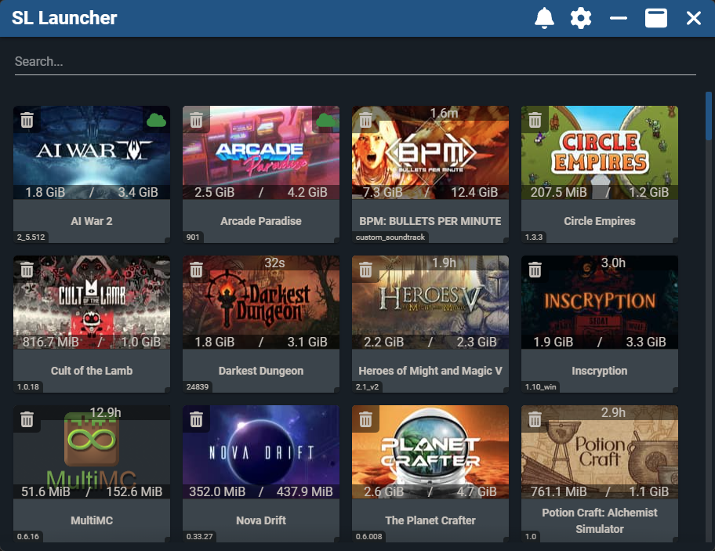

# Game Launcher

## What is This? Why does this exist?
---

### What is it?
This is a game launcher, think Steam, for all of your owned DRM-Free games or any other games that don't require some other launcher. You can basically show anything that you can execute in here, including a lovely use case emulators!



### Why is it?
I got tired of installing my GOG games and having to use the awful windows 11 start menu to find and launch them. Trying to search for them and just getting Bing results instead of the locally installed program! C'mon Windows.. 

So, being a competent developer and having a desire to make an Electron app for the experience of it, I started this project. Now my whole family uses it regularly to play out games.

Over time it has evolved to support far more than the GOG games it was built for. I have Ryujinx and all my ripped games as "dlc" so I can install /uninstall them easily. 

## Features
---
- Download, install and uninstall Games and DLC with the press of a button
  - Supports installation scripts for setting registry entries, moving files outside the game folder, and more
  - Supports installing redistributables for games silently, if not already installed
  - Downloads and installs show you a progress bar
- Setup mod packs as DLC packages to automatically share and install mod sets
- Manage multiple versions of a game so you can go back for mods or because of new bugs
- Get notified of updates to games and install them with ease
- Synchronize saves to the cloud so your progress follows you wherever you go
- Get automatic app updates, if you setup an updates server, or use mine
- Flags to startup in fullscreen or maximized for integration with Steam big picture
- Hard kill games after launch if they get stuck or freeze
- See the download and install sizes for all games in the repo server, if remote server is configured.
- Use the launcher with a remote server or 100% local and offline
  - Just install all your games to the same folder and point the launcher to that folder
- Limited Controller support for browsing, installing, and launching games
  - Better support for managing DLC and saves coming later
- Tracks playtime, and synchronizes that to cloud if cloud is configured
  - I like stats
- Protocol handler (`slgame://GAME_ID`) to launch a game linked from anywhere
- Search the game library with ease and speed
- Hide games behind a settings panel toggle for those... special... games 
- Sorting options
  - Alphabetic
  - Recently Played 
  - Total Playtime
  - Recently Added 
  - Recently Updated 
- If cloud is setup and you're offline, you can still play just fine!

### Parental/System Controls
*Right now there is nothing stopping a child from changing the config file or using the cli args, that will change*
- Config option `sys_locked`
  - Locks loading the Launcher unless run with the `--sys_locked_allow true` cli arg set
- Config option `ins_locked`
  - Locks installing and uninstalling games unless run with the `--ins_locked_allow true` cli arg set

## I want to host my own cloud repo, how?!?
---

Hosting a repo isn't very hard but there are some pretty specific things you have to do.  
There are two components right now for self-hosting this, update server and WebDAV file repo.

### Update Server
This one has a lot of options. This project uses `electron-updater` so any update server that supports `electron-updater` will work, though I have a server specifically for this app ([SL Game Launcher API](https://gitlab.sololegends.com/sololegends/game-launcher-api)) which will be getting full support for every server/cloud aspect of this app over time.  

Right now it only supports electron updater for multiple apps through API access only with a full authentication setup. 
You can use it for easy update publishing with CI pipelines, which is what I do.  You certainly don't need this, but I built it for experience sake and for the future updates. 

- To disabled update checking entire use the runtime flag `skip_update` 
- To change the update feed without having to compile yourself, use `alt_feed=$update_endpoint`

If you want to set your own update server you need to alter `vue.config.js#pluginOptions.builderOptions.publish.url`

### File Repository

In theory and file repository that supports WebDAV should work, I use [Nextcloud](https://nextcloud.com/).  

It all hinges on a specific file structure: 
```
$WebDAVFolder:
  |-$game_name
    |- .data
      |- logo.[jpg|png]
			|- game_data.json
			|- {...Any Remote DLC Uninstall descriptors}
		|- {...Game and DLC download files}
```

- `$WebDAVFolder` : The folder configured in the launcher under WebDAV Config
- `$game_name` : Friendly name of the game, this is what is shows in the Launcher when displaying remote games
- `game_data.json` : The game data generated by the repacker or created by other means
  - See: [Defining the Game Data](docs/GameDataJSON.md)
- `logo.xxx` : The logo to display for the game, should be some multiple of 200px width 120px height


The launcher, after loading local games it will list the directory configured as `$WebDAVFolder` reading the game_data.json and pulling the icon to a local/data cache. The directory is still listed every time, but the json and icons are always cache preferred on initial load.

## Development
---
## Project setup
You will need to install `yarn` and `nodejs` 16.x.

There is a helper script to install them 
```
./run install
```

After that, simply run `yarn` in the project root to pull the node_modules needed.

## Compiles and hot-reloads for development
```
yarn exe
```

### Minifies for Production and Builds EXE
```
yarn exe-build
```

# Repacking GOG Games from EXEs
There is a nice script in the `tools` directory called `repack` which handles the typescript compilation and execution.

1. Dump the EXEs you want to unpack somewhere
2. If there are DLC installers put them by themselves in another directory
3. Run repack targeting the main exe and the dlc folder 
   - EX: `./repack $path_to_main_exe $path_to_dlc [#options]`

That's it! Now you should have a zip file in the output directory (defaults to `tools/game_repacked`) along with the icon extracted and the game data json with metadata and install instructions for the launcher. 

## Repack Options
*All options are, well, optional*

| Option | Type | Default | Description |
|---|---|---|---|
| `output` | `string` | "game_repacked" | The output directory for extraction and repacking result |
| `clear` | `flag` | unset | Flag to only cleanup the used directories. DLC folder, the Game EXE, and packing output |
| `nopack` | `flag` | unset | Flag to skip the packing stage leaving just the extracted files |
| `merge_data` | `flag` | unset | Flag to trigger merging of remote data with the new generated data. Will pull remote data or use data in cwd |
| `merge_info` | `flag` | unset | Alias of `merge_data` because I kept forgetting how I wrote it so I made both work.. |
| `zip_level` | `0-9` | 8 | Standard zip compression level for the final package |


# What's Coming up Later? 
See ./TODO for my current todo
